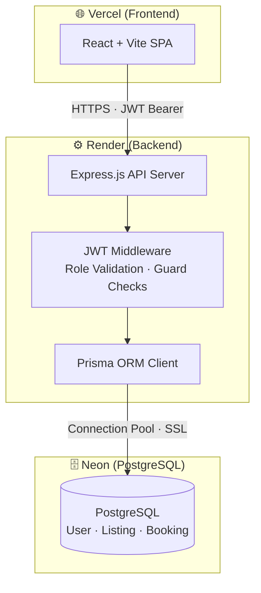
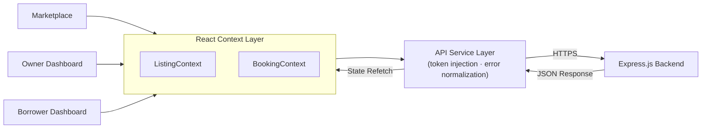
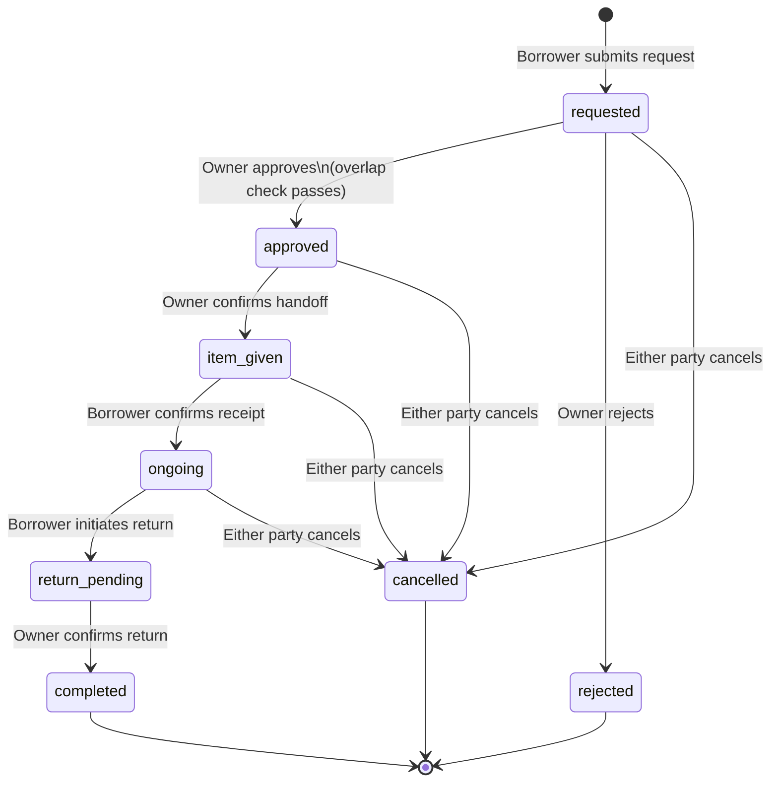
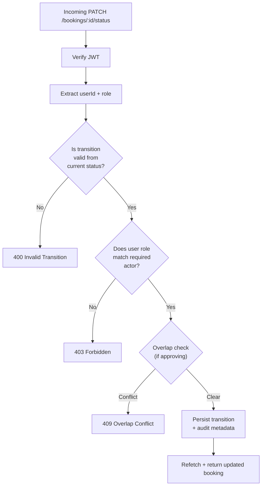
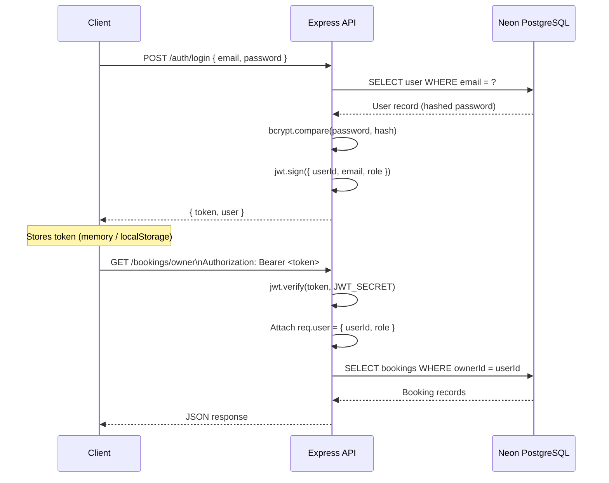
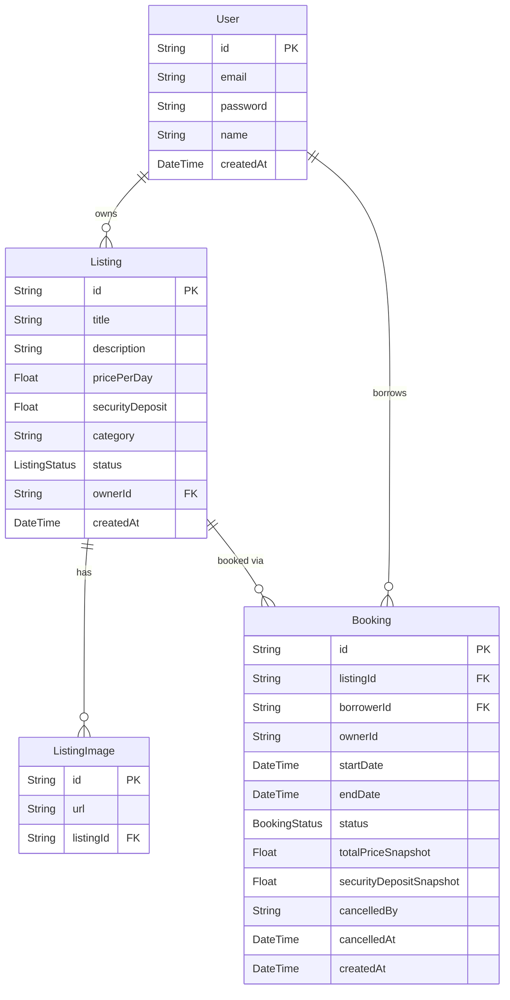
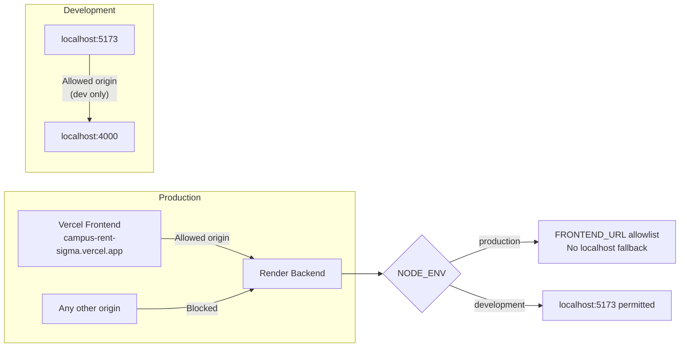

# CampusRent — System Architecture

This document covers the full technical architecture of CampusRent: deployment topology, request flow, booking state machine, database schema, and authentication pipeline.

---

## 1. Deployment Topology



---

## 2. Frontend Request Flow



> The frontend never reads from local state after a mutation. Every write is followed by a backend refetch — the database is the canonical source of truth.

---

## 3. Booking Lifecycle State Machine



### Overlap Conflict Prevention

Before any `requested → approved` transition, the engine queries all bookings for the same listing in states `approved`, `item_given`, `ongoing`, or `return_pending` and validates that no date range intersection exists. The check explicitly excludes `requested`, `cancelled`, `rejected`, and `completed` to avoid blocking legitimate future bookings from other requesters.

### Cancellation Audit

Every cancellation stamps `cancelledBy` (owner or borrower) and `cancelledAt` (UTC timestamp) onto the booking record at persistence time. This is enforced at the API layer — the client cannot modify or omit these fields.

---

## 4. Role-Based Transition Guards



| Transition | Required Actor |
|---|---|
| `requested → approved / rejected` | Owner |
| `approved → item_given` | Owner |
| `item_given → ongoing` | Borrower |
| `ongoing → return_pending` | Borrower |
| `return_pending → completed` | Owner |
| `* → cancelled` | Owner or Borrower |

---

## 5. Authentication Flow



---

## 6. Database Schema



### Key Design Decisions

**Snapshot fields on Booking** — `totalPriceSnapshot` and `securityDepositSnapshot` are written at booking creation time from the listing's current price. If the owner later changes pricing, historical bookings retain their original cost. This is the only safe approach for financial records.

**`ownerId` denormalized onto Booking** — Rather than joining through `Listing` to find the owner on every dashboard query, `ownerId` is stored directly on `Booking`. This halves the join depth for the owner's most frequent query pattern.

**B-Tree indexes** on `Listing.ownerId` and `Booking.listingId` — these two fields appear in the `WHERE` clause of every high-frequency query (owner dashboard load, overlap conflict check, borrower history). Indexed at migration time.

**Prisma enums for status fields** — `BookingStatus` and `ListingStatus` are defined as Prisma enums backed by PostgreSQL native enums. Invalid string states cannot reach the database at the ORM layer, before any application-level validation runs.

---

## 7. CORS & Environment Architecture



The backend reads `FRONTEND_URL` from environment at startup and constructs its CORS allowlist from that value alone. There is no hardcoded localhost fallback that could leak into the production environment — the configuration module enforces this at load time and throws if `NODE_ENV=production` and `FRONTEND_URL` is absent.

---

## 8. Technical Debt Register

This section tracks known architectural limitations, their impact, and the production-scale solution for each.

---

### 8.1. Client-Side Sort and Location Filter Operate on Paginated Results

**Summary:**  
The Marketplace page applies sorting (Newest, Price, Rating) and location filtering entirely on the client side. Because the backend returns only the current page (default 8 items), these operations run against the paginated subset rather than the full result set.

**Impact:**  
- Sorting by "Price: Low to High" shows the cheapest 8 items on the current page, not the 8 cheapest items overall.
- Filtering by location only checks the 8 items on the current page — matching items on other pages are never surfaced.
- Search and category filter are unaffected because they execute server-side, before pagination.

**Root Cause:**  
The `GET /api/listings` endpoint accepts `q` (text search), `category`, `page`, and `limit` query parameters. It does not support `sort` or `location` parameters. Sort and location were kept client-side to avoid overcomplicating the initial pagination migration, but the introduction of pagination made client-side post-processing incorrect for these two operations.

**Production-Scale Solution:**  
Add server-side sort and location filter support to `GET /api/listings` by accepting `sort` and `location` query parameters and handling them in the Prisma query before pagination:

```javascript
// Example implementation in listingService.js getActiveListings()

if (sort) {
  switch (sort) {
    case 'price_asc':
      orderBy.dailyRentalRate = 'asc';
      break;
    case 'price_desc':
      orderBy.dailyRentalRate = 'desc';
      break;
    case 'rating':
      orderBy.owner = { lenderRating: 'desc' };
      break;
    case 'newest':
    default:
      orderBy.createdAt = 'desc';
  }
}

if (location) {
  where.preferredPickupZone = { contains: location, mode: 'insensitive' };
}
```

This ensures that sort and location filter are applied to the **entire** result set before the `skip`/`take` pagination window, giving correct results regardless of page number.

**Migration Path:**  
1. Add `sort` and `location` to the list of accepted query params in the controller.
2. Map the frontend's `sortOption` values to backend sort keys.
3. Move the location filter from the `displayListings` useMemo into the API request params.
4. Remove the client-side sort and location filter from `Marketplace.jsx`.
5. Verify correctness by asserting that page 1 sorted by price_asc contains the globally cheapest items.

**Status:**  `Unresolved — tracked as technical debt`

---

### 8.2. Pagination Does Not Preserve Filters Across Page Navigation

**Summary:**  
When a user is on the Marketplace, applies filters, and navigates to page 2, the search/filter state is held in React component state and lost if the component unmounts (e.g., navigating to a listing detail and back).

**Impact:**  
- Users may need to re-apply filters when returning to the marketplace.
- No URL-based state serialization means bookmarking a filtered search is impossible.

**Production-Scale Solution:**  
Use URL search params (`/marketplace?q=camera&category=Tech&page=2&sort=price_asc`) as the canonical filter state source. React Router's `useSearchParams` can synchronize filter state with the URL, making it bookmarkable and resilient to navigation.

**Status:**  `Unresolved — tracked as technical debt`
